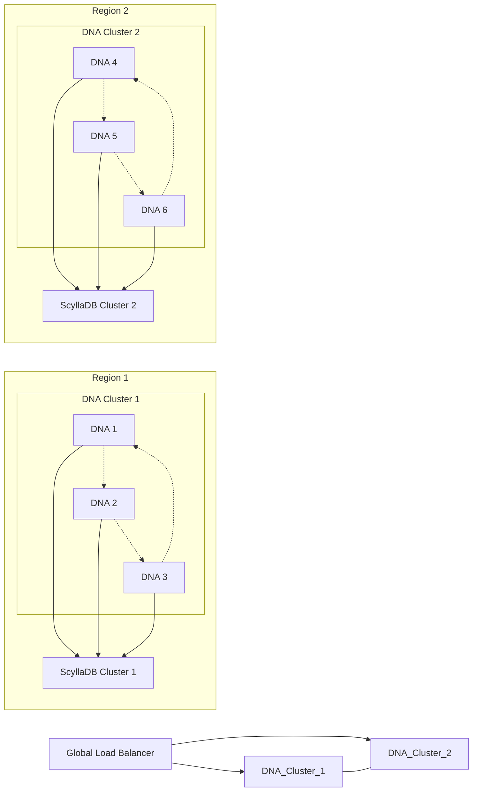
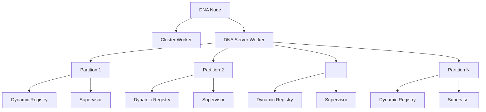
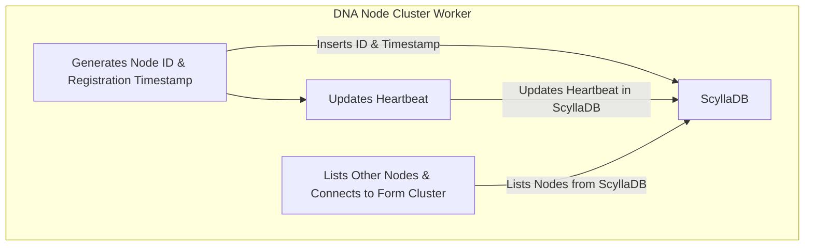
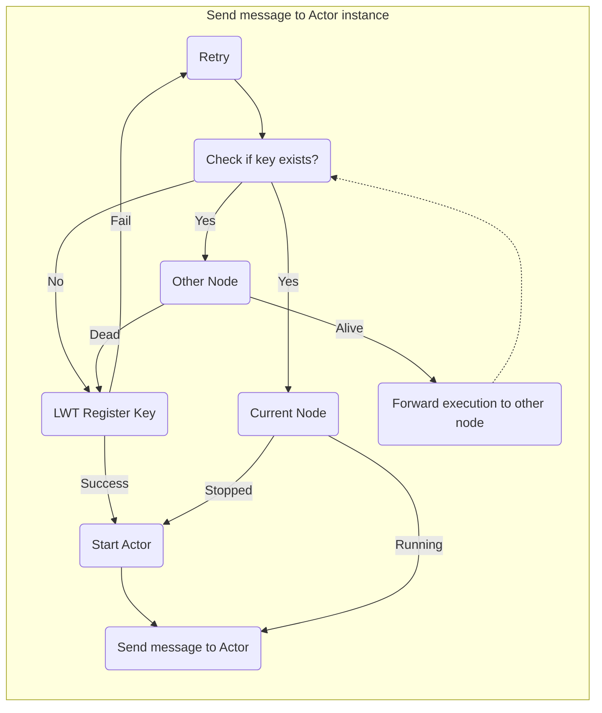
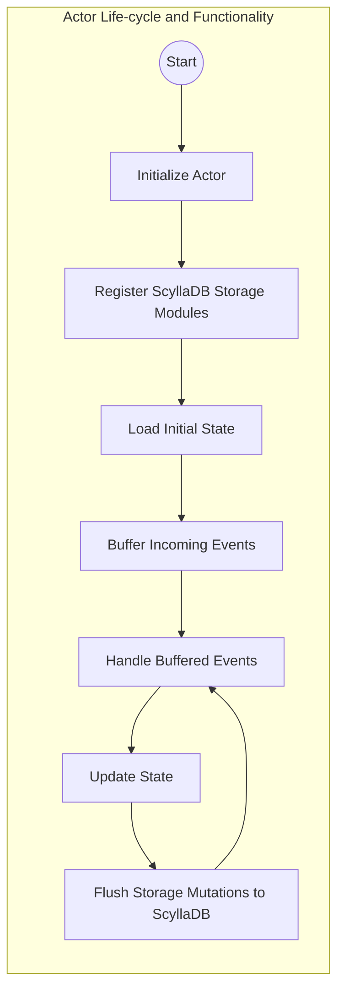
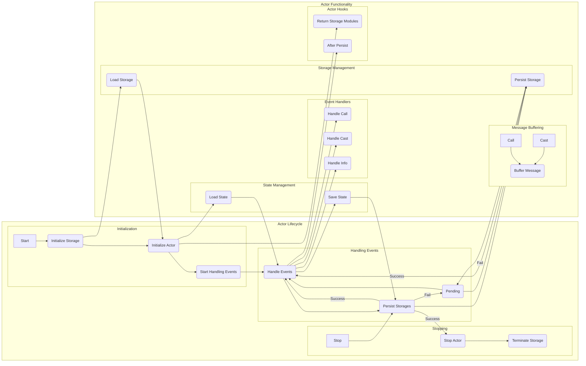

# Architecture diagrams
## High level

```mermaid
graph LR
    A --> DNA_Cluster_1
    A --> DNA_Cluster_2
    DNA_Cluster_1 --- DNA_Cluster_2
    A[Global Load Balancer]
    subgraph Region 1
        subgraph DNA Cluster 1
            B[DNA 1] -.-> C[DNA 2]
            C -.-> D[DNA 3]
            D -.-> B
        end
        E[ScyllaDB Cluster 1]
        B --> E
        C --> E
        D --> E
    end
    subgraph Region 2
        subgraph DNA Cluster 2
            F[DNA 4] -.-> G[DNA 5]
            G -.-> H[DNA 6]
            H -.-> F
        end
        I[ScyllaDB Cluster 2]
        F --> I
        G --> I
        H --> I
    end
```

## Main Application loop

```mermaid
graph TD
    A[DNA Node] --> B[Cluster Worker]
    A --> C[DNA Server Worker]
    C --> D[Partition 1]
    D --> E[Dynamic Registry]
    D --> F[Supervisor]
    C --> G[Partition 2]
    G --> H[Dynamic Registry]
    G --> I[Supervisor]
    C --> J[...]
    J --> K[Dynamic Registry]
    J --> L[Supervisor]
    C --> M[Partition N]
    M --> N[Dynamic Registry]
    M --> O[Supervisor]

```

## Cluster worker

```mermaid
flowchart TB
    subgraph DNA Node Cluster Worker
        A[Generates Node ID & Registration Timestamp]
        B[Updates Heartbeat]
        C[Lists Other Nodes & Connects to Form Cluster]
        D[ScyllaDB]
    end
    A --> B
    A -->|Inserts ID & Timestamp| D
    B -->|Updates Heartbeat in ScyllaDB| D
    C -->|Lists Nodes from ScyllaDB| D
```

## Actor intance request execution

```mermaid
flowchart LR
    subgraph Send message to Actor instance
        Start[Start] --> CheckKey(Check if key exists?)
        CheckKey -- No --> TryRegisterKey(LWT Register Key )
        TryRegisterKey -- Success --> StartActor(Start Actor)
        StartActor --> SendMsg(Send message to Actor)
        TryRegisterKey -- Fail --> Start(Retry)
        CheckKey -- Yes --> CurrentNode(Current Node)
        CurrentNode -- Running --> SendMsg
        CurrentNode -- Stopped --> StartActor
        CheckKey -- Yes --> OtherNode(Other Node)
        OtherNode -- Dead --> TryRegisterKey
        OtherNode -- Alive --> ForwardToOtherNode(Forward execution to other node)
        ForwardToOtherNode -.-> CheckKey
    end
```
## Actor Instance High Level

```mermaid
flowchart LR
    subgraph Actor Life-cycle and Functionality
        A((Start)) --> B[Initialize Actor]
        B --> C[Register ScyllaDB Storage Modules]
        C --> D[Load Initial State]
        D --> E[Buffer Incoming Events]
        E --> F[Handle Buffered Events]
        F --> G[Update State]
        G --> H[Flush Storage Mutations to ScyllaDB]
        H --> F
    end
```

## Actor instance flow

```mermaid
flowchart LR
subgraph Actor Lifecycle
subgraph Initialization
Start[Start] --> InitStorage(Initialize Storage)
InitStorage --> InitActor(Initialize Actor)
InitActor --> StartHandling(Start Handling Events)
end
subgraph Handling Events
StartHandling --> HandleEvents(Handle Events)
HandleEvents --> PersistStorages(Persist Storages)
PersistStorages -- Success --> HandleEvents
PersistStorages -- Fail --> Pending(Pending)
Pending --> HandleEvents
end
subgraph Stopping
Stop[Stop] --> PersistStorages
PersistStorages -- Success --> StopActor(Stop Actor)
StopActor --> TerminateStorage(Terminate Storage)
end
end
subgraph Actor Functionality
subgraph Message Buffering
Call[Call] --> Buffer(Buffer Message)
Cast[Cast] --> Buffer
end
subgraph Event Handlers
HandleEvents --> HandleCall(Handle Call)
HandleEvents --> HandleCast(Handle Cast)
HandleEvents --> HandleInfo(Handle Info)
end
subgraph State Management
InitActor --> LoadState(Load State)
LoadState --> HandleEvents
HandleEvents --> SaveState(Save State)
SaveState --> PersistStorages
end
subgraph Storage Management
InitStorage --> LoadStorage(Load Storage)
LoadStorage --> InitActor
PersistStorages --> PersistStorage(Persist Storage)
PersistStorage -- Success --> HandleEvents
PersistStorage -- Fail --> Pending
Pending --> PersistStorage
end
subgraph Actor Hooks
InitActor --> StorageFunctionality(Return Storage Modules)
HandleEvents --> HandleAfterPersist(After Persist)
end
end
```